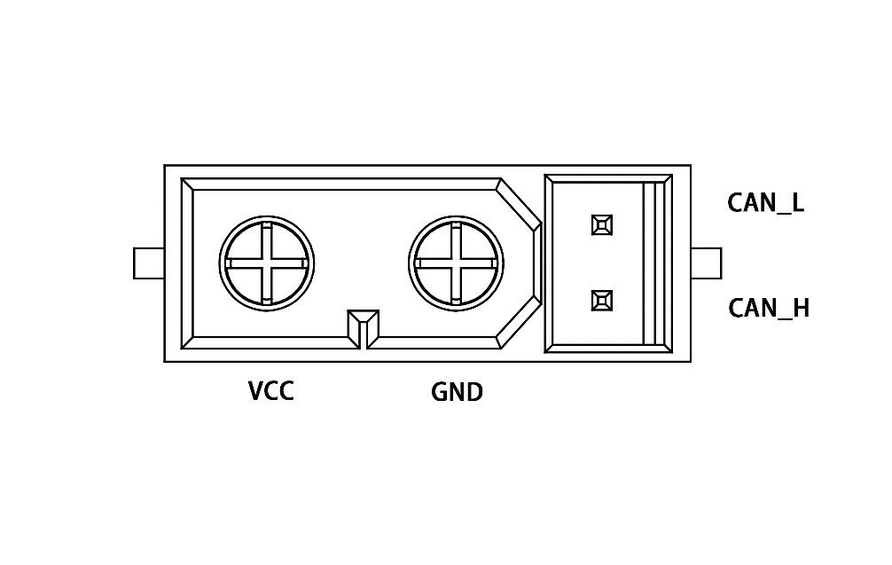
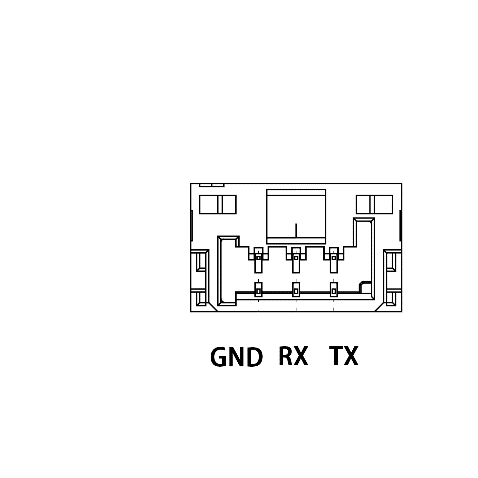
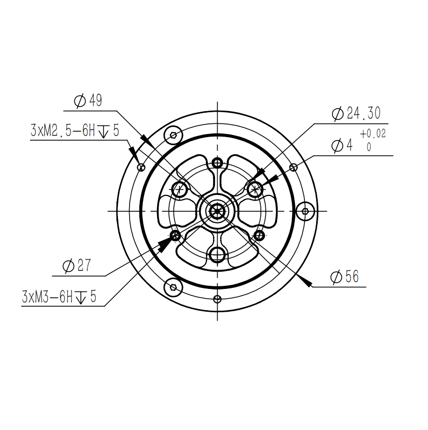
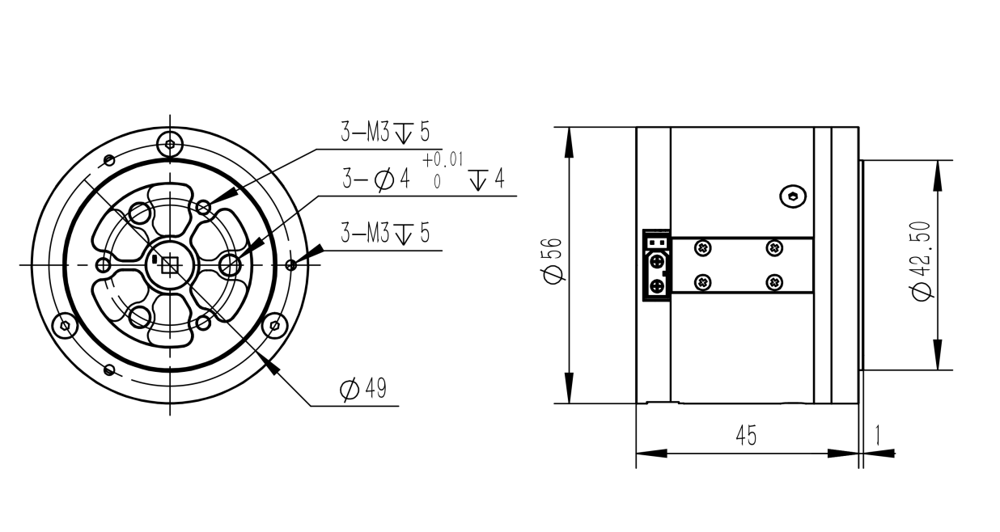
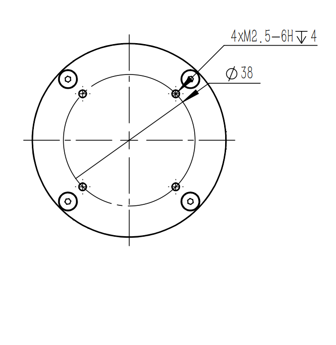
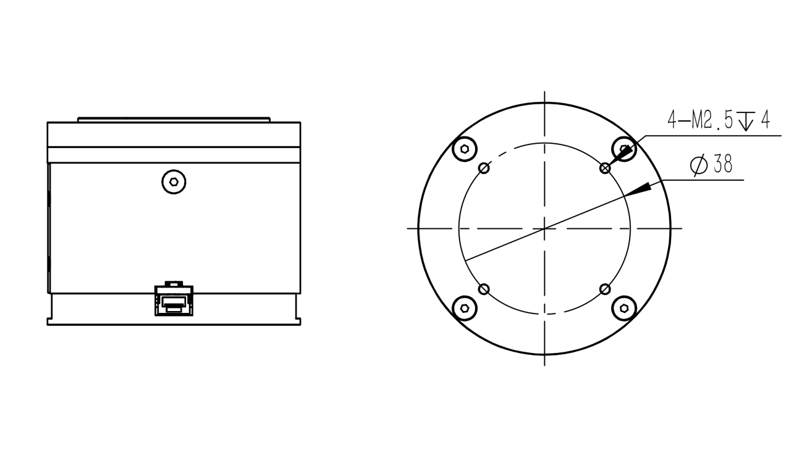
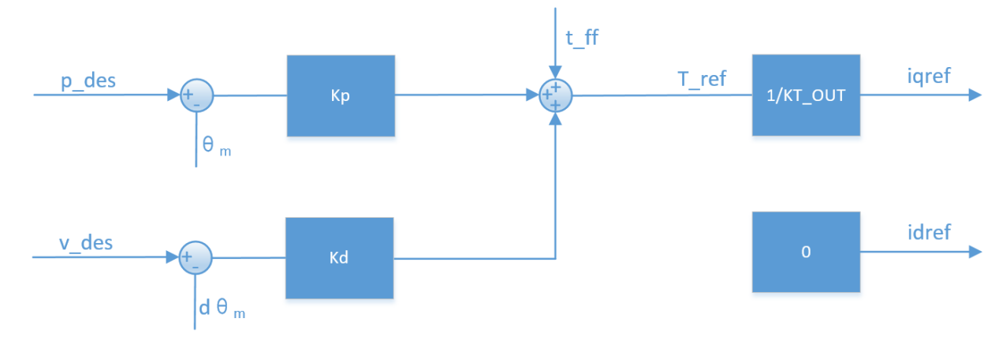
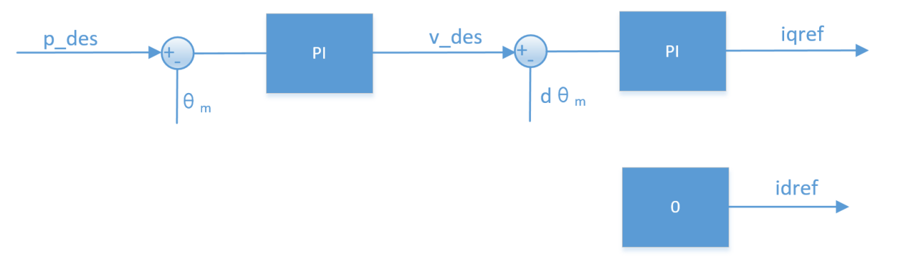
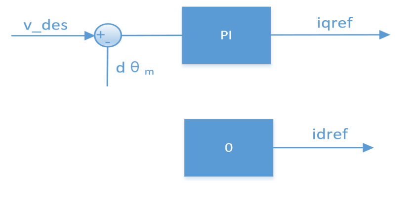
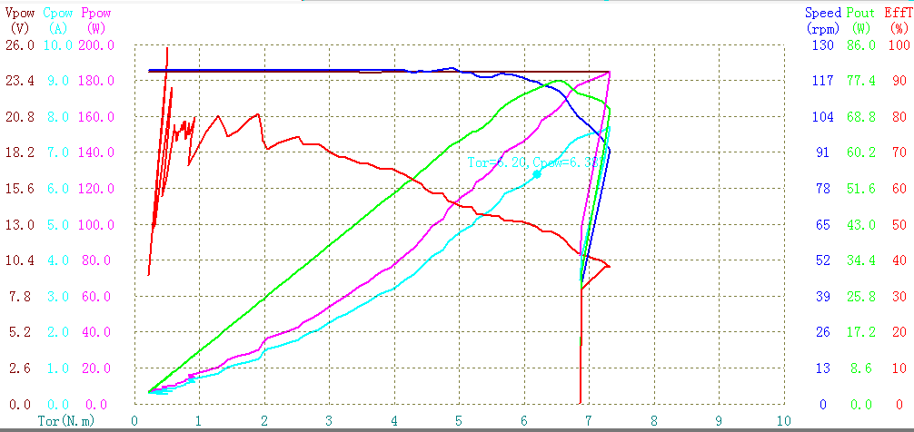

# **DAMIAO |** 达妙科技

DM-J4310-2EC减速电机

| 日期       | 版本 | 变更内容 |
| ---------- | ---- | -------- |
| 2022.10.14 | V1.0 | 初版创建 |

## 注意事项

+ 请严格按照规定的工作环境及绕组最大允许温度范围使用电机，否则会对产品造成永久性不可逆转的损坏。

+ 避免杂物进入转子内部，否则会导致转子运行异常。

+ 使用前请检查各零部件是否完好。如有部件缺失、老化、损坏等，请停止使用。

+ 确保正确接线，电机安装正确、稳固。

+ 使用时勿触摸电子转子部分，避免意外发生。电机大扭矩输出时，会出现发热的情况，请注意避免烫伤。

+ 用户请勿私自拆卸电机，否则会影响电机的控制精度，甚至会导致电机运行异常。

  

## 接口线序介绍

#### 电源接口（含CAN通讯端子）

+ 通过XT30(2+2)-F插头的电源连接线连接电源，额定电压为24V，为电机供电。  

+ 通过CAN通信端子连接外部控制设备，可接收CAN控制命令，反馈电机状态信息。

+ 电机包含两个电源接口，任一接口可单独连接使用，也可多机串联使用，方便走线。  

#### 调试串口-3

通过GH1.25连接线-3pin，使用USB转CAN调试工具（或使用通用USB转串口模块）连接到PC，通过达妙科技调试助手对电机进行参数设置，以及固件升级等。

## 电机尺寸及安装

请参考电机安装孔尺寸和位置将电机安装到对应设备。

## 指示灯状态

<table>
	<tr>
	    <td rowspan="2">正常状态</td>
	    <td>绿灯常亮</td>
	    <td>使能模式，正常工作状态</td>
    </tr>
	<tr>
	    <td>红灯常亮</td>
	    <td>失能模式</td>
	</tr>
    <tr>
	    <td rowspan="1">异常状态</td>
	    <td>红灯闪烁</td>
		<td>表示故障，对应故障类型为：
              
		8——超压；           9——欠压；
             
		A——过电流；         B——MOS过温；
              
		C——电机线圈过温；   D——通讯丢失；
              
		E——过载
              
        可通过反馈帧，或通过达妙科技调试助手界面显示，查看发生何种故障。
		</td>
    </tr>
</table>   

### 工作模式

#### MIT模式

​		MIT模式是为了兼容原版MIT模式所设计，可以在实现无缝切换的同时，能够灵活设定控制范围（P_MAX,V_MAX，T_MAX），电调将接收到的CAN数据转化成控制变量进行运算得到扭矩值作为电流环的电流给定，电流环根据其调节规律最终达到给定的扭矩电流。其控制示意框图如下：

​		根据MIT模式可以衍生出多种控制模式，如kp=0,kd不为0时，给定v_des即可实现匀速转动;kp=0,kd=0，给定t_ff即可实现给定扭矩输出。

​		*注意：对位置进行控制时，kd**不能赋0**，否则会造成电机震荡，甚至失控。*

####  位置速度模式

​		位置串级模式是采用三环串联控制的模式，位置环作为最外环，其输出作为速度环的给定，而速度环的输出作为内环电流环的给定，用以控制实际的电流输出，其控制示意框图见下图：

​		p_des为控制的目标位置，v_des是用来限定运动过程中的最大绝对速度值。位置串级模式如使用调试助手推荐的控制参数控制，可以达到较好的控制精度，控制过程相对柔顺，但响应时间相对较长。可配置的相关参数除v_des外，另有加/减速度进行设定，如控制过程中产生额外的震荡可提高加/减速度。

*注意：p_des，v_des单位分别为rad和rad/s，数据类型为float，阻尼因子必须设置为**非0**的正数，可参考速度模式的注意事项。*

#### 速度模式

​		速度模式能让电机稳定运行在设定的速度，其控制示意框图如下：

* ​	注意：v_des**单位为rad/s**，数据类型为float**，如需使用调试助手自动计算参数，则需要设置阻尼因子为非0**正数，通常情况下取值在2.0~10.0**，过小的阻尼因子会带来速度的震荡以及较大的过冲，过大的阻尼因子则会带来较长的上升时间，推荐的设定值为4.0**。

## 使用

​		控制使用CAN标准帧格式，固定波特率为1Mbps，按功能可分为接收帧和反馈帧，接收帧为接收到的控制数据，用于实现对电机的命令控制；反馈帧为电机向上层控制器发送电机的状态数据。根据电机选定的不同模式，其接收帧帧格式定义以及帧ID各不相同，但各种模式下的反馈帧是相同的。

### 反馈帧

​		反馈帧ID由调试助手设置（Master ID），默认为0，主要反馈电机的位置，速度和扭矩信息，其帧格式定义为：

| 反馈报文 | D[0]       | D[1]      | D[2]     | D[3]      | D[4]              | D[5]   | D[6]  | D[7]    |
| -------- | ---------- | --------- | -------- | --------- | ----------------- | ------ | ----- | ------- |
| MST_ID   | ID\|ERR<<4 | POS[15:8] | POS[7:0] | VEL[11:4] | VEL[3:0]\|T[11:8] | T[7:0] | T_MOS | T_Rotor |

其中：

ID表示控制器的ID，取CAN_ID的低8位

ERR表示故障，对应故障类型为：

8——超压；       

9——欠压；

A——过电流；      

B——MOS过温；

C——电机线圈过温；   

D——通讯丢失；

E——过载；

POS表示电机的位置信息

VEL表示电机的速度信息

T表示电机的扭矩信息

T_MOS表示驱动上MOS的平均温度，单位℃

T_Rotor表示电机内部线圈的平均温度，单位℃

位置、速度和扭矩采用线性映射的关系将浮点型数据转换成有符号的定点数据，其中位置采用16位数据，速度和扭矩均使用12位。

###  MIT模式下控制帧

| 控制报文 | D[0]        | D[1]       | D[2]        | D[3]                 | D[4]    | D[5]     | D[6]                | D[7]      |
| -------- | ----------- | ---------- | ----------- | -------------------- | ------- | -------- | ------------------- | --------- |
| ID       | p_des[15:8] | p_des[7:0] | v_des[11:4] | v_des[3:0]\|Kp[11:8] | Kp[7:0] | Kd[11:4] | Kd[3:0]\|t_ff[11:8] | t_ff[7:0] |

帧ID等于设定的CAN ID值

​	P_des：位置给定

​	V_des：速度给定

​	Kp：位置比例系数

​	Kd：位置微分系数

​	T_ff：转矩给定值

​		各参数符合上一节的映射关系，其中p_des,v_des,t_ff的范围可由调试助手进行设定，Kp的范围为[0,500]，Kd的范围为[0,5]。

​		标准CAN数据一帧只有8个字节，MIT的控制命令格式将Position、Velocity、Kp、Kd、Torque五个参数按位组合在8个字节中。其中：Position占用2个字节16位、Velocity占用12位、Kp占用12位、Kd占用12位。

<table>
    <tr>
        <td align="center" >控制报文</td> 
        <td align="center">D[0]</td> 
        <td align="center">D[1]</td> 
        <td align="center">D[2]</td> 
        <td align="center">D[3]</td> 
        <td align="center">D[4]</td> 
        <td align="center">D[5]</td>
        <td align="center">D[6]</td> 
        <td align="center">D[7]</td> 
   </tr>
   <tr>
       <td align="center">0x100+ID</td> 
       <td colspan="4" align="center">p_des</td>
       <td colspan="4" align="center">v_des</td>    
   </tr>
</table>

​	帧ID为设定的CAN ID值加上0x100的偏移

​	**P_des**：位置给定，浮点型，低位在前，高位在后

​	**V_des**：速度给定，浮点型，低位在前，高位在后

​	此处发送命令的CAN ID是0x100+ID。速度给定是梯形加速度运行下最高速度的，即为匀速段的速度值。

### 速度模式下控制帧

<table>
    <tr>
        <td align="center" >控制报文</td> 
        <td align="center">D[0]</td> 
        <td align="center">D[1]</td> 
        <td align="center">D[2]</td> 
        <td align="center">D[3]</td> 
   </tr>
   <tr>
       <td align="center">0x200+ID</td> 
        <td colspan="4" align="center" >v_des</td>    
   </tr>
</table>

​	帧ID为设定的**CAN ID**值加上0x200的偏移

​	**V_des**：速度给定，浮点型，低位在前，高位在后

​	此处发送命令的CAN ID是*0x200+ID。*

## 使用达妙科技调试助手

​		使用达妙科技USB转CAN调试工具，连接电脑和电机，通过达妙科技助手对电机进行参数设置以及固件升级。

​		电机调试串口通过GH1.25连接线-3pin连接PC，电机电源接口中CAN通信端子通过XT30(2+2)-F插头连接线连接USB转CAN调试工具，通过达妙科技调试助手对电机进行参数设置，以及固件升级等。

​		电机的串口、CAN口以及电源接口连通后，电脑端打开达妙科技调试助手，选择相应的串口设备并打开串口。此时给电机供电，串口会打印信息，Control Mode指示当前驱动模式。

## 电机参数

​			定速120rpm，室温25℃下，测得的性能曲线图：

## 特征参数

<table>
    <tr>
        <td rowspan=7>电机参数</td>
        <td>额定电压</td>
        <td>24V</td>
    </tr>
    <tr>
        <td>额定电流</td>
        <td>2.5A</td>
    </tr>
    <tr>
        <td>峰值电流</td>
        <td>7.5A</td>
    </tr>
    <tr>
        <td>额定扭矩</td>
        <td>3NM</td>
    </tr>
    <tr>
        <td>峰值扭矩</td>
        <td>7NM</td>
    </tr>
    <tr>
        <td>额定转速</td>
        <td>120rpm</td>
    </tr>
    <tr>
        <td>空载最大转速</td>
        <td>200rpm</td>
    </tr>
    <tr>
        <td rowspan=4>电机特征值</td>
        <td>减速比</td>
        <td>10: 1</td>
    </tr>
    <tr>
        <td>极对数</td>
        <td>14</td>
    </tr>
    <tr>
        <td>相电感</td>
        <td>340uH</td>
    </tr>
    <tr>
        <td>相电阻</td>
        <td>650mΩ</td>
    </tr>
    <tr>
        <td rowspan=3>结构与重量</td>
        <td>外径</td>
        <td>56mm</td>
    </tr>
    <tr>
        <td>高度</td>
        <td>46mm</td>
    </tr>
    <tr>
        <td>电机重量</td>
        <td>约300g</td>
    </tr>
    <tr>
        <td rowspan=3>编码器</td>
        <td>编码器位数</td>
        <td>14位</td>
    </tr>
    <tr>
        <td>编码器个数</td>
        <td>2</td>
    </tr>
    <tr>
        <td>编码器类型</td>
        <td>磁编（单圈）</td>
    </tr>
    <tr>
        <td rowspan=2 >通讯</td>
        <td>控制接口</td>
        <td>CAN@1Mbps</td>
    </tr>
    <tr>
        <td>调参接口</td>
        <td>UART@921600bps</td>
    </tr>
    <tr>
        <td rowspan=9>控制与保护</td>
        <td rowspan=3>控制模式</td>
        <td>MIT模式</td>
    </tr>
    <tr>
        <td>速度模式</td>
    </tr>
    <tr>
        <td>位置模式</td>
    </tr>
    <tr>
        <td rowspan=6>保护</td>
        <td>驱动过温防护，防护温度：120℃，过温电机将退出“使能模式”</td>
    </tr>
    <tr>
        <td>电机过温防护，根据使用需求设定，建议不超过100℃，过温电机将退出“使能模式”</td>
    </tr>
    <tr>
        <td>电机过压防护，根据使用需求设定，建议不超过32V，过压将退出“使能模式”</td>
    </tr>
    <tr>
        <td>通讯丢失防护，设定周期内没有收到CAN指令将自动退出“使能模式”</td>
    </tr>
    <tr>
        <td>电机过流防护，根据使用需求设定，建议不超过9.8A，过流将退出“使能模式”</td>
    </tr>
    <tr>
        <td>电机欠压防护，若电源电压低于设定值，则退出“使能模式”，电源电压不低于15V</td>
    </tr>
</table>
